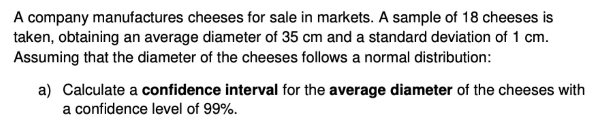

# Confidence intervals: a quick overview in R.

## Student's T-Distribution

To build a confidence interval using the `qt` function in R, you can follow these steps. Given that you have the sample mean, sample standard deviation, and sample size, you can calculate the confidence interval as follows:

1.  Calculate the standard error (SE).
2.  Determine the critical t-value using the `qt` function.
3.  Construct the confidence interval using the formula: `mean ± (t-value * SE)`.

Here's a detailed example:

### Example

Assume we have the following values: - Sample mean (`sample_mean`): 50 - Sample standard deviation (`sample_sdev`): 5 - Sample size (`sample_size`): 25 - Confidence level: 95% (0.95)

``` r
# Given values
sample_mean <- 35          # Sample mean
sample_sdev <- 1          # Sample standard deviation
sample_size <- 18          # Sample size
confidence_level <- 0.99   # Confidence level

# Step 1: Calculate the standard error
standard_error <- sample_sdev / sqrt(sample_size)

# Step 2: Determine the t-value for the given confidence level and degrees of freedom
degrees_of_freedom <- sample_size - 1
alpha <- 1 - confidence_level
t_value <- qt(1 - alpha / 2, df = degrees_of_freedom)

# Step 3: Construct the confidence interval
margin_of_error <- t_value * standard_error
confidence_interval <- c(sample_mean - margin_of_error, sample_mean + margin_of_error)

# Print the confidence interval
print(confidence_interval)
```

### Explanation:

1.  **Standard Error Calculation**:

    ``` r
    standard_error <- sample_sdev / sqrt(sample_size)
    ```

    The standard error (SE) is the sample standard deviation divided by the square root of the sample size.

2.  **Critical t-value Calculation**:

    ``` r
    degrees_of_freedom <- sample_size - 1
    alpha <- 1 - confidence_level
    t_value <- qt(1 - alpha / 2, df = degrees_of_freedom)
    ```

    The critical t-value is found using the `qt` function. For a 95% confidence level, the alpha level is 0.05, and you need to find the t-value for the 97.5th percentile (since it's a two-tailed test).

3.  **Constructing the Confidence Interval**:

    ``` r
    margin_of_error <- t_value * standard_error
    confidence_interval <- c(sample_mean - margin_of_error, sample_mean + margin_of_error)
    ```

    The confidence interval is calculated by adding and subtracting the margin of error from the sample mean.

### Output:

The output will give you the lower and upper bounds of the confidence interval. For instance, if you run the code above, it might output something like:

``` r
[1] 47.776 52.224
```

This means the 95% confidence interval for the population mean is between 47.776 and 52.224.

### Another practical problem:



Here we have a sample size of 18, so we need to use the t-distribution to build the confidence intervals since the population standard deviation $$\sigma$$ is unknown, and the sample size $$n$$ is \< 30.

```{r}

#Distribution inputs:
sample_size <- 18
sample_sdev <- 1
sample_mean <- 35
alpha <- 0.01
freedom_degrees <- sample_size -1
standard_error <- sample_sdev / sqrt(sample_size)

#Building the confidence interval:
t_stat <- qt(p= 1-alpha/2, df=freedom_degrees)
conf_interval <- c(sample_mean - (standard_error * t_stat),
                   sample_mean + (standard_error * t_stat))
cat("The t-statistic is:", t_stat,"\n", "The confidence interval is:", "(",conf_interval, ")")

```
